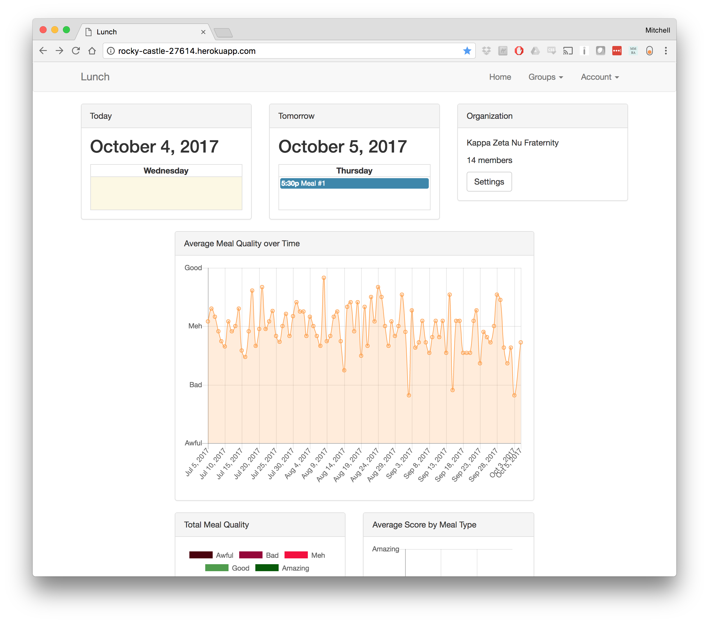
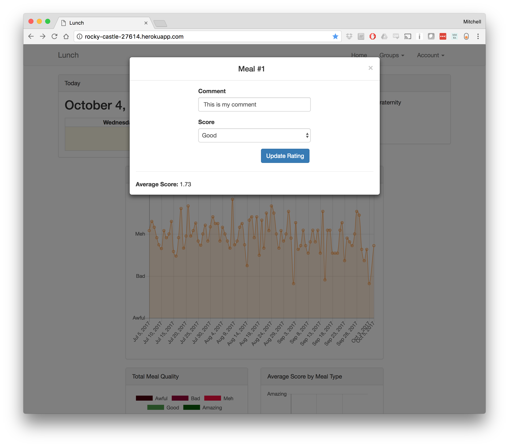
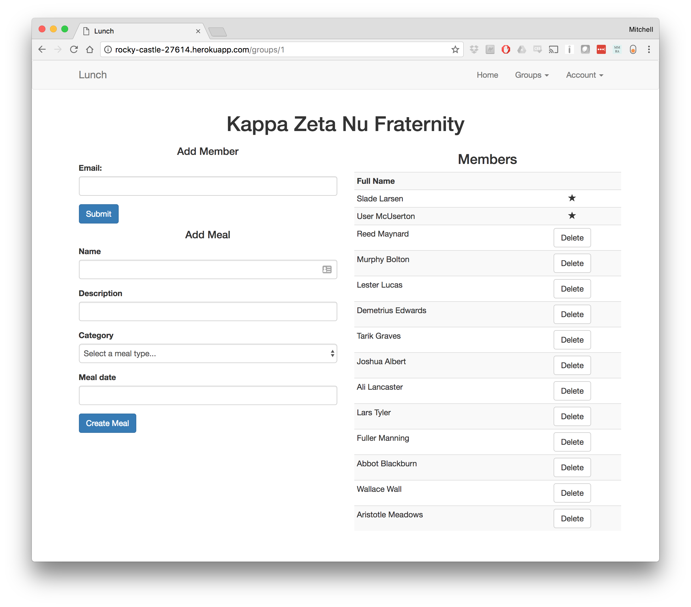

# Lunch

## What does it do?

>Allows an organzation (that serves meals) to collect metrics on meal quality and frequency based on user feedback.

Try Lunch out at http://rocky-castle-27614.herokuapp.com (email: user@fake.com, password: password)

## Watch meal quality change over time.

## Leave feedback on individual meals

## Easily add and remove members

## Disclaimer
Lunch is not production ready, many normal features you would expect are unimplemented because they were boring and I didn't implement them.

If you think that Lunch is something that you would like to use, contact me mitchellhanberg@gmail.com.

